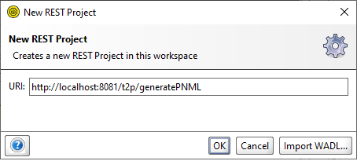
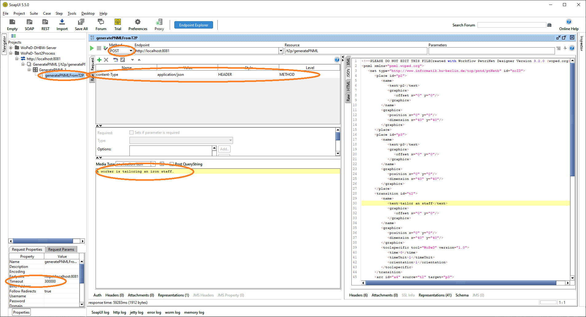

<h1>Welcome to the WoPeD-Text2Process SpringBoot-Application</h1>

This application is tailored to handle all requests from WoPeD to generate a PNML-String from a given Text.

<h2>Configuration Guide - IntelliJ IDEA</h2>

This manual describes the configuration of the WoPeD-Text2Process process in IntelliJ IDEA.
 

<h3>Installing the required software</h3>

If you have already installed all the required Software go ahead with the next step.

Preset:
<ul>
<li>Install OpenJDK 11 or higher</li>
<li>Install Apache Maven</li>
<li>Install Git</li>
<li>Install IntelliJ IDEA</li>
<li>Activate you JetBrains student account</li>
<li>Install SoapUI (or another tool for to test Rest-APIs)</li>
<li>Clone this repository to your local machine</li>
</ul>

<h3>Resolving all the dependencies</h3>

The next step is resolving the missing dependencies of the project. There three tasks are necessary. 
First of all you need to ad the projects lib folder as library.
This is done by clicking it with the right mouse button and choosing "Add as Library".
It will open a new dialogue in which you need to ensure that the library is just included into the project not on a global level. 
The second step is to ensure, that all the third party libraries a imported by Maven.
Therefore you need to perform a right click on the project and then do a mouseover on Maven and choose reimport from the opening submenu.
This could take some time to finish, because the stanford models are quite large. 
The third and last step is checking whether the proper jdk is used or not.
File -> Project structure will open a new dialogue.
Now go to the project view and check the SDK and language settings.

 

<h3>Starting the Application</h3>

Finally it is time to give it a try.
You can find the main file in the source package.
The are two ways to start the application.
On the one hand you can click on the play button at the upper right connor in your IDE or on the other it is possible to run it by clicking right on the WoPeDText2ProcessApplication-Class.

Maven will automatically compile the source code to a runnable application. After that the SpringBootServer will start and load the configuration given by the application.properties file.
After a short time of loading the server will listen to the port and root path you configured.

<h2>Testing the WebServices</h2>

The server is exposing different webservices, which can be called.
To test the functionality WoPeD-UI is using we need a proper tool to send POST requests to the ReSTController.
We are using SoapUI as required in the installation guide.
New it is time to set it up the right way.

