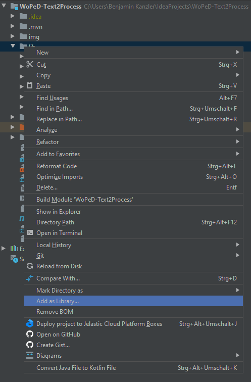
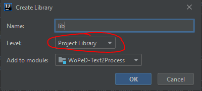
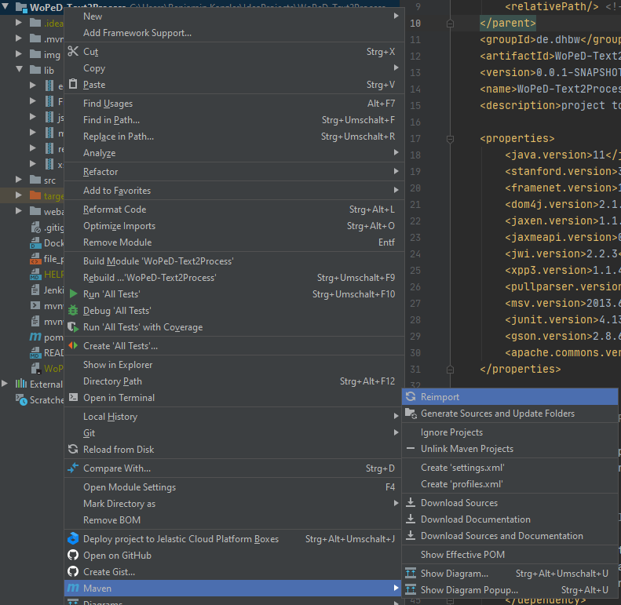
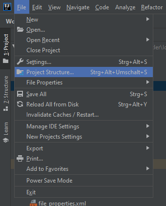
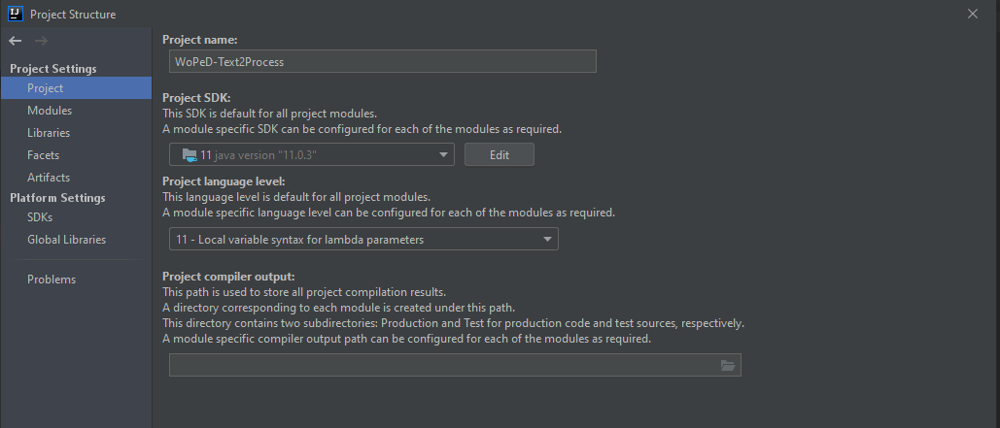
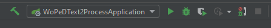
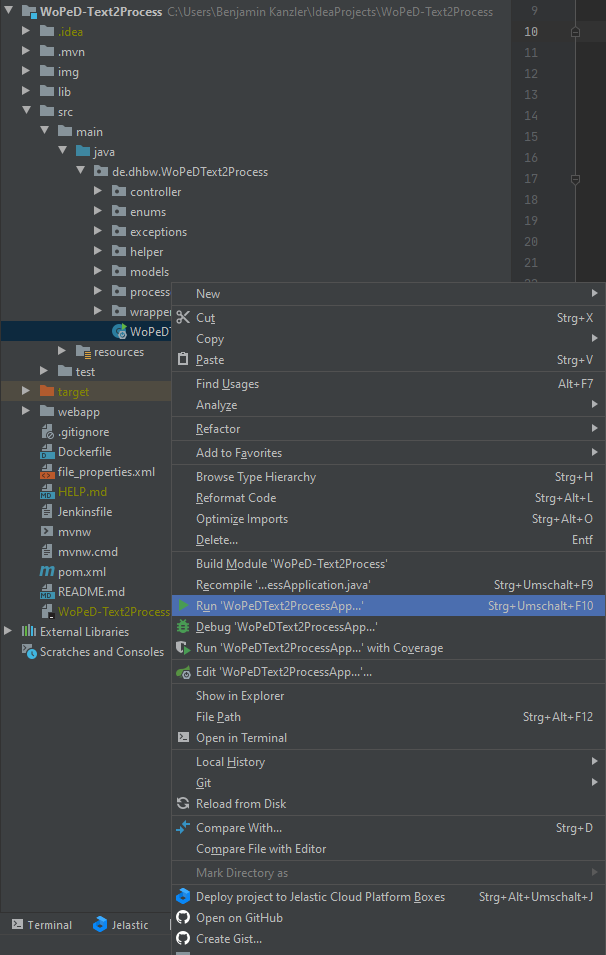

# Text to Process (T2P)
This application is tailored to handle all requests from WoPeD to generate a PNML-String from a given Text.

# Live demo
| URL           | Description   | 
| ------------- |:-------------:|
| https://woped.dhbw-karlsruhe.de/t2p/ | Embedded UI|
| https://woped.dhbw-karlsruhe.de/t2p/swagger-ui| Swagger UI|

# Related repositories
| URL           | Description   |
| ------------- |:-------------:|
| https://github.com/tfreytag/P2T | Process2Text Webservice |
| https://github.com/tfreytag/WoPeD | WoPeD-Client |

# Resources
| URL           | Description   |
| ------------- |:-------------:|
| https://hub.docker.com/r/woped/text2process | Docker Hub|

# Requirements for development
- <a href="https://aws.amazon.com/de/corretto/">OpenJDK 11</a> or higher
- <a href="https://maven.apache.org/">Apache Maven</a>
- <a href="https://git-scm.com/">Git</a>
- <a href="https://www.jetbrains.com/de-de/idea/">IntelliJ IDEA</a>

# Testing
### Testing via Swagger UI
1. Start the application.
2. Navigate to `http://localhost:8081/t2p/swagger-ui.`
3. Insert your business process description in the body of the `POST /t2p/generatePNML` endpoint.

### Testing via the embedded GUI
1. Start the application.
2. Navigate to `http://localhost:8081/t2p/`.
3. Insert your business process description into the second text area and click on `generate`.

### Testing via the WoPeD-Client
1. Start the application.
2. Follow the installation instructions of the WoPeD-Client (`https://github.com/tfreytag/WoPeD`).
3. Start WoPeD-Client and.
4. Open the configuration and navigate to `NLP Tools`. Adapt the `Text2Process` configuration:
    - `Server host`: `localhost`
    - `Port`: `8081`
    - `URI`: `/t2p`
5. Test your configuration.
6. Close the configuration.
7. Navigate to `Analyse` -> `Translate to process model` and execute. The text will now be transformed by your locally started T2P webservice.

# Hosting the webservice yourself
### Option 1: Use our pre-build docker image
1. Pull our pre-build docker image from docker hub (see above).
2. Run this image on your server.
### Option 2: Build the docker image yourself
1. Build your own docker image with the Dockerfile.
2. Run this image on your server.

# Configuration guide
_It is recommended to use IntelliJ IDE._
<h3>Resolving all the dependencies</h3>

The next step is resolving the missing dependencies of the project. There three tasks are necessary. 
First of all you need to ad the projects lib folder as library.
This is done by clicking it with the right mouse button and choosing "Add as Library".
It will open a new dialogue in which you need to ensure that the library is just included into the project not on a global level. 

The second step is to ensure, that all the third party libraries a imported by Maven.
Therefore you need to perform a right click on the project and then do a mouseover on Maven and choose reimport from the opening submenu.

This could take some time to finish, because the stanford models are quite large. 
The third and last step is checking whether the proper jdk is used or not.
File -> Project structure will open a new dialogue.
Now go to the project view and check the SDK and language settings.

 

<h3>Starting the Application</h3>

Finally it is time to give it a try.
You can find the main file in the source package.
The are two ways to start the application.
On the one hand you can click on the play button at the upper right connor in your IDE or on the other it is possible to run it by clicking right on the WoPeDText2ProcessApplication-Class.

Maven will automatically compile the source code to a runnable application. After that the SpringBootServer will start and load the configuration given by the application.properties file.
After a short time of loading the server will listen to the port and root path you configured.

